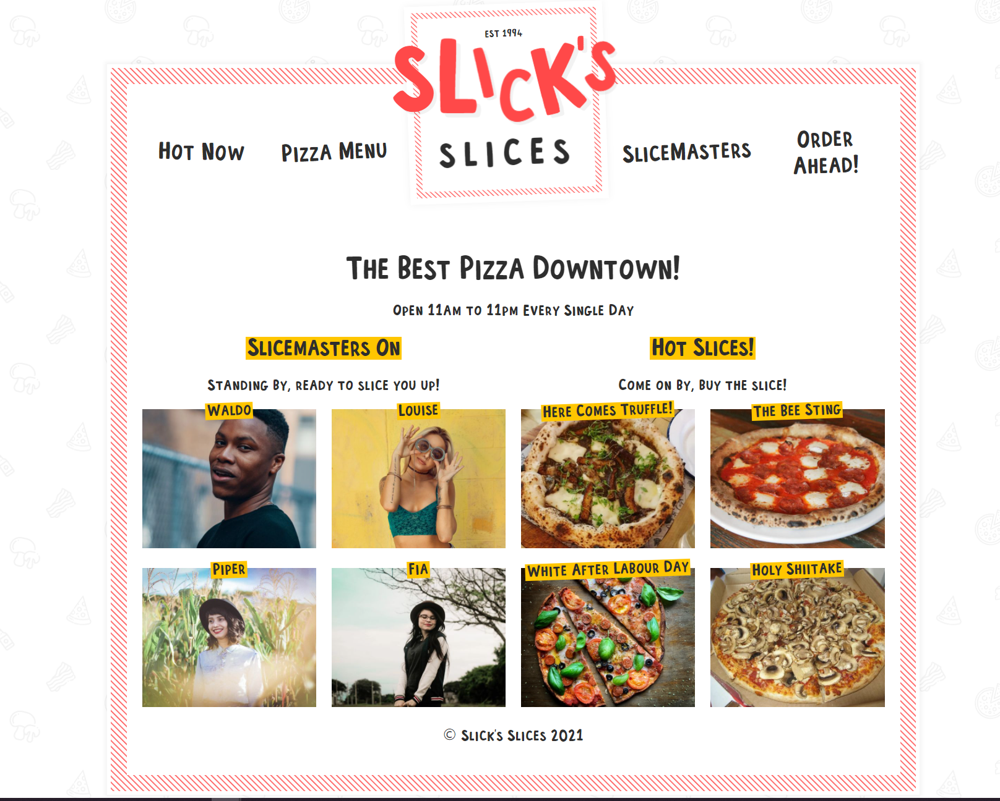

# Slick's Slices

Welcome to Slick's! The best pizza place downtown! This site was built with Gatsby for the fastest user experience as well as GraphQL and Sanity.io for backend api requests.

## Table of Contents

- [Installation](#installation)
- [Usage](#usage)
- [Links](#Links)
- [Technologies](#Technologies)
- [License](#License)

## Installation

1. Download or clone repository
2. `npm install` to install the required npm packages to run

## Usage

- Application will be invoked by using the following command:

  `npm start`

- Open your browser and go to

  `http://localhost:8000`

- Home page displays pizzas and slicers
- Pizza page displays all available pizza and allows users to choose by topping
- Slicemasters page displays all slicers and their bios
- Order ahead page allows users to place their order and receive email confirmation

## Links

- [Github](https://github.com/jongomezdev/pizza)
- [Deployed App](https://jg-pizza.netlify.app/)

## Technologies

- React
- Gatsby.js
- GraphQL
- Sanity
- Styled Components
- JavaScript

## License

This program is free software: you can redistribute it and/or modify
it under the terms of the GNU General Public License as published by
the Free Software Foundation, either version 3 of the License, or
(at your option) any later version.
This program is distributed in the hope that it will be useful,
but WITHOUT ANY WARRANTY; without even the implied warranty of
MERCHANTABILITY or FITNESS FOR A PARTICULAR PURPOSE.See the
GNU General Public License for more details.
You should have received a copy of the GNU General Public License
along with this program. If not, see <https://www.gnu.org/licenses/>

## Contributing

PR's PR's PR's!

## Questions

Check out my other repositories in the link below:

- [GitHub Profile](https://github.com/jongomezdev)

- For any additional questions, please [email](mailto:jongomezdev@gmail.com) me.
